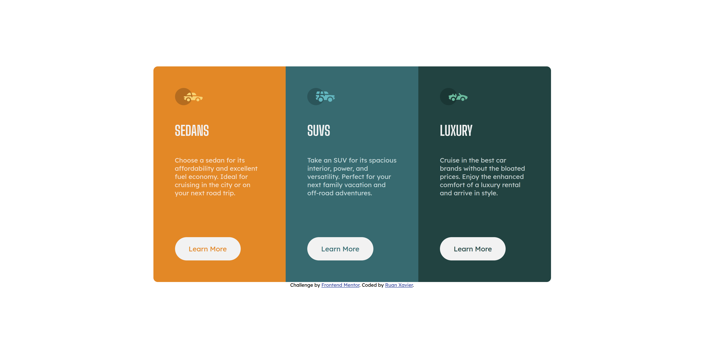

# Frontend Mentor - Solução para o componente de cartão de pré-visualização em 3 colunas

Esta é uma solução para o [desafio do componente de cartão de pré-visualização em 3 colunas no Frontend Mentor](https://www.frontendmentor.io/challenges/3column-preview-card-component-pH92eAR2-).

## Visão geral

### O desafio

O objetivo é criar um componente de cartão de pré-visualização em 3 colunas que se adapte a diferentes tamanhos de tela e tenha estados de hover interativos.

### Captura de tela

.png)

### Links

- URL da solução: [Adicione a URL da solução aqui](https://sua-url-da-solução.com)
- URL do site ao vivo: [Adicione a URL do site ao vivo aqui](https://sua-url-do-site-ao-vivo.com)

## Meu processo

### Construído com

- HTML5
- CSS personalizadas
- Flexbox

### O que aprendi

Aprendi como criar um layout responsivo com `flexbox` e como aplicar animações de hover para melhorar a interatividade.

### Recursos úteis

- [Origamid](https://www.origamid.com) - Excelente conteúdo sobre front-end e design responsivo.
- [W3Schools](https://www.w3schools.com) - Plataforma útil para aprender HTML, CSS e JavaScript com exemplos práticos.

## Autor

- Frontend Mentor - [@ruan-xavier](https://www.frontendmentor.io/profile/ruan-xavier)
- GitHub - [ruan-xavier](https://github.com/ruan-xavier)
- YouTube - [@RuanHenriqueXavier](https://www.youtube.com/@RuanHenriqueXavier)
